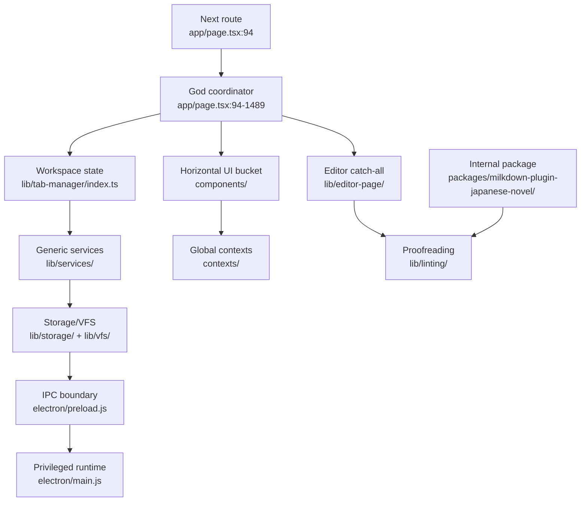

# Repository feature inventory

Date: 2026-06-19

## Scope and baseline

This inventory covers tracked application source and its build/documentation contracts. Generated output and local caches are not architecture inputs.

- Application source: 577 files and approximately 125,800 lines across `app/`, `components/`, `contexts/`, `lib/`, `electron/`, `nlp-service/`, and `packages/` after ruleset framework PR #1795.
- Tests: 155 colocated test files (`components`: 25, `lib`: 109, `electron`: 13, package: 8).
- Largest coordinator: `app/page.tsx` at 1,490 lines and more than 50 direct imports (`app/page.tsx:4-59`).
- Generated/local footprint: `dist-electron/` 1.8 GB, `.next/` 295 MB, `dist-main/` 137 MB. These are already ignored by `.gitignore:9-30` and must never be architecture or review inputs.
- Runtime static assets: `public/` 32 MB, of which about 13 MB is editable `.psd`/`.ai` source material that is not referenced at runtime.

## Phase 0: authoritative contracts

The reorganization must preserve these current contracts.

| Contract                    | Source of truth                                                                     | Constraint                                                                                                                           |
| --------------------------- | ----------------------------------------------------------------------------------- | ------------------------------------------------------------------------------------------------------------------------------------ |
| Next.js routes              | `app/` and `ARCHITECTURE.md:22-23`                                                  | Keep `app/` route-only. Do not introduce a second router root.                                                                       |
| Service worker              | `next.config.ts:9-14`                                                               | `app/sw.ts` and generated `public/sw.js` remain wired together.                                                                      |
| Electron process boundary   | `ARCHITECTURE.md:3`, `ARCHITECTURE.md:31-32`                                        | Renderer code never imports Electron main modules. Privileged access remains behind preload/IPC.                                     |
| Electron bundle entrypoints | `scripts/bundle-electron.mjs:30-69`                                                 | Keep `electron/main.js` and `electron/preload.js` as stable entrypoints while reorganizing their internals.                          |
| TypeScript alias            | `tsconfig.json:21-23`                                                               | `@/*` currently resolves from repository root; preserve it during incremental moves.                                                 |
| Test discovery              | `vitest.config.ts:5-8`                                                              | Tests may remain colocated in `__tests__/`; update coverage paths when `lib/` disappears.                                            |
| Milkdown package            | `packages/milkdown-plugin-japanese-novel/package.json` and its `tsconfig.json:1-17` | A package must compile without importing application-root aliases.                                                                   |
| Documentation               | `docs/README.md:12-30`                                                              | `docs/` remains the canonical design/documentation tree.                                                                             |
| Lint rulesets               | `docs/ruleset/README.md`, `docs/ruleset/authoring.md`, and repository `AGENTS.md`   | Preserve the merged SDK/registry/toolkit/loader contract; dictionary-backed rules warn and disable when the dictionary is not ready. |

## Ruleset framework integration baseline

The structural refactor is based on merged PR #1795, not its original pre-merge base.

- Branch: `feature/ruleset-foundation-restore`
- PR: #1795, merged into `dev`
- Merge commit and current baseline: `c18396668c7cc7f76d230b862a0d4723ddd153e0`
- Included feature commits: `98c0100`, `8cafaa2`, `d23e067`, `dc8cff7`, `7ea1afd`
- Included CI-fix commit: `1ea6249`

The following is one atomic framework surface during later moves:

- SDK and runtime: `lib/linting/{sdk,registry,toolkit}/`, `lib/linting/external-ruleset-loader.ts`, `lib/linting/lint-presets.ts`
- Editor/worker wiring: `lib/editor-page/use-linting.ts` and `packages/milkdown-plugin-japanese-novel/linting-plugin/worker/{linting.worker,protocol,rule-runner-proxy}.ts`
- UI: `components/settings/LintingSettings.tsx` and `components/settings/linting/`
- Electron contract: `electron/rulesets-manager.js`, `electron/ipc/rulesets-ipc.js`, `electron/preload.js`, `electron/lib/ipc-channels.js`, and `types/electron.d.ts`
- Canonical docs: `docs/ruleset/`

Do not move only one side of this chain. Manifest validation, requirement gating, worker loading, IPC integrity checks, UI status, and documentation must remain version-aligned.

## Current feature boundaries

| Feature                     | Current entry points                                            | Core files                                                                                                                                              | Current structural problem                                                                                                                                                |
| --------------------------- | --------------------------------------------------------------- | ------------------------------------------------------------------------------------------------------------------------------------------------------- | ------------------------------------------------------------------------------------------------------------------------------------------------------------------------- |
| Application shell           | `app/page.tsx:94`, `app/layout.tsx`                             | `components/EditorLayout.tsx`, seven files in `contexts/`                                                                                               | Route, orchestration, feature state, exports, and UI prop assembly are mixed in one 1,490-line component.                                                                 |
| Workspace/files             | `lib/tab-manager/index.ts`, `lib/project/project-service.ts`    | `lib/services/project-file-service.ts`, `lib/services/history-service.ts`, `lib/services/file-watcher.ts`, `lib/dockview/`, explorer/history components | Ownership is split among `lib/tab-manager`, `lib/project`, generic `lib/services`, root components, and contexts.                                                         |
| Editor/MDI                  | `components/Editor.tsx`, `components/editor/MilkdownEditor.tsx` | `lib/editor-page/`, `packages/milkdown-plugin-japanese-novel/mdi-document.ts`                                                                           | Editor-specific logic is a 48-file catch-all and the package contains application-coupled plugins.                                                                        |
| Proofreading/dictionary/NLP | `lib/editor-page/use-linting.ts`                                | `lib/linting/` SDK/registry/toolkit/loader, worker proxy, `lib/dict/`, NLP clients/backend, ruleset settings and inspector UI                           | The merged ruleset framework spans application, package, UI, and IPC roots; the Milkdown package still imports application code, reversing the intended package boundary. |
| Search/inspection           | `components/SearchDialog.tsx`, `components/SearchResults.tsx`   | `lib/editor-page/project-search.ts`, `lib/search-dialog/`, inspector statistics/readability files                                                       | Search, dictionary lookup, statistics, and inspection UI are distributed across four generic roots.                                                                       |
| Export                      | `lib/export/use-export.ts`                                      | `lib/export/*`, `components/ExportDialog.tsx`, `electron/ipc/file-ipc.js`                                                                               | Browser and Electron adapters are legitimate, but orchestration also lives directly in `app/page.tsx:630-951`.                                                            |
| Settings/commands           | `components/SettingsModal.tsx`, `components/settings/`          | `contexts/EditorSettingsContext.tsx`, `contexts/KeymapContext.tsx`, `lib/keymap/`, `lib/menu/`                                                          | Settings state, command definitions, menu adapters, and UI are separated by technical type rather than ownership.                                                         |
| Authentication              | `contexts/AuthContext.tsx`, `app/auth/callback/page.tsx`        | `lib/auth/`, `app/api/auth/`, `components/settings/AccountSettingsTab.tsx`                                                                              | Thin context and adapters are separated from their only consumers.                                                                                                        |
| Electron platform           | `electron/main.js:27-61`, `electron/preload.js`                 | `electron/ipc/`, top-level managers, `electron/lib/`                                                                                                    | Entrypoints are valid, but managers and shared security primitives are mixed at the same level; Electron is excluded from ESLint (`eslint.config.mjs:23-35`).             |

## Current-state overview

