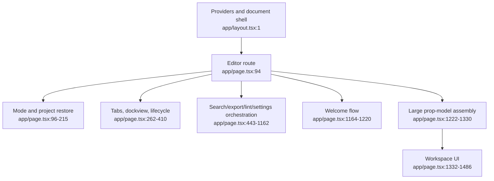

# Application shell

```mermaid
flowchart TD
  Layout["Providers and document shell<br/>app/layout.tsx:1"] --> Route["Editor route<br/>app/page.tsx:94"]
  Route --> Restore["Mode and project restore<br/>app/page.tsx:96-215"]
  Route --> Workspace["Tabs, dockview, lifecycle<br/>app/page.tsx:262-410"]
  Route --> Features["Search/export/lint/settings orchestration<br/>app/page.tsx:443-1162"]
  Route --> Welcome["Welcome flow<br/>app/page.tsx:1164-1220"]
  Route --> Props["Large prop-model assembly<br/>app/page.tsx:1222-1330"]
  Props --> EditorLayout["Workspace UI<br/>app/page.tsx:1332-1486"]
```

External dependencies: every renderer feature. This is the central coupling point and must become a thin composition boundary.
