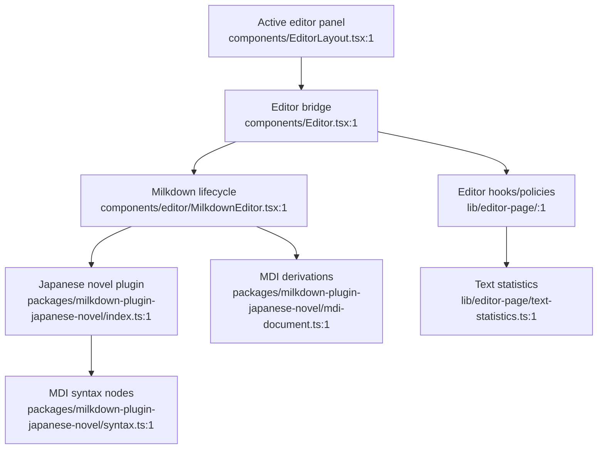

# Editor and MDI

```mermaid
flowchart TD
  Workspace["Active editor panel<br/>components/EditorLayout.tsx:1"] --> Editor["Editor bridge<br/>components/Editor.tsx:1"]
  Editor --> Milkdown["Milkdown lifecycle<br/>components/editor/MilkdownEditor.tsx:1"]
  Milkdown --> Plugin["Japanese novel plugin<br/>packages/milkdown-plugin-japanese-novel/index.ts:1"]
  Plugin --> Syntax["MDI syntax nodes<br/>packages/milkdown-plugin-japanese-novel/syntax.ts:1"]
  Milkdown --> Document["MDI derivations<br/>packages/milkdown-plugin-japanese-novel/mdi-document.ts:1"]
  Editor --> Lifecycle["Editor hooks/policies<br/>lib/editor-page/:1"]
  Lifecycle --> Stats["Text statistics<br/>lib/editor-page/text-statistics.ts:1"]
```

External dependencies: workspace buffers, settings, search, proofreading/NLP.
