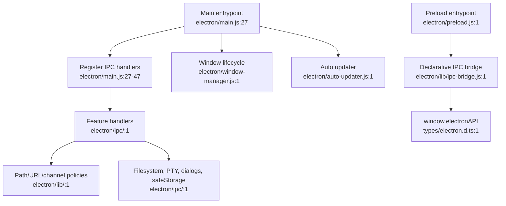

# Electron platform

```mermaid
flowchart TD
  Main["Main entrypoint<br/>electron/main.js:27"] --> Register["Register IPC handlers<br/>electron/main.js:27-47"]
  Main --> Windows["Window lifecycle<br/>electron/window-manager.js:1"]
  Main --> Updates["Auto updater<br/>electron/auto-updater.js:1"]
  Register --> IPC["Feature handlers<br/>electron/ipc/:1"]
  IPC --> Policy["Path/URL/channel policies<br/>electron/lib/:1"]
  Preload["Preload entrypoint<br/>electron/preload.js:1"] --> Bridge["Declarative IPC bridge<br/>electron/lib/ipc-bridge.js:1"]
  Bridge --> Renderer["window.electronAPI<br/>types/electron.d.ts:1"]
  IPC --> OS["Filesystem, PTY, dialogs, safeStorage<br/>electron/ipc/:1"]
```

External dependencies: shared export/storage/NLP code and native modules. `main.js` and `preload.js` remain stable bundle entrypoints.
