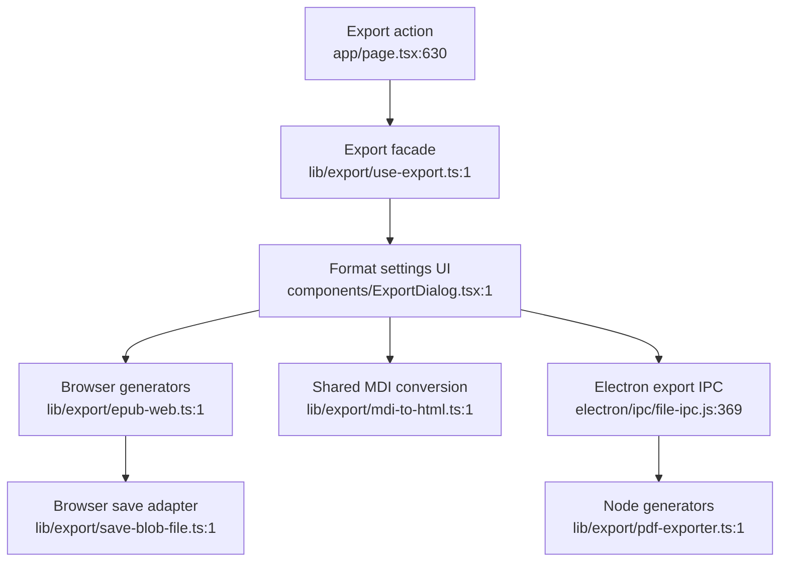

# Export

```mermaid
flowchart TD
  Menu["Export action<br/>app/page.tsx:630"] --> Hook["Export facade<br/>lib/export/use-export.ts:1"]
  Hook --> Dialog["Format settings UI<br/>components/ExportDialog.tsx:1"]
  Dialog --> Browser["Browser generators<br/>lib/export/epub-web.ts:1"]
  Dialog --> Shared["Shared MDI conversion<br/>lib/export/mdi-to-html.ts:1"]
  Dialog --> Electron["Electron export IPC<br/>electron/ipc/file-ipc.js:369"]
  Electron --> Native["Node generators<br/>lib/export/pdf-exporter.ts:1"]
  Browser --> Save["Browser save adapter<br/>lib/export/save-blob-file.ts:1"]
```

External dependencies: MDI document API, project metadata, browser file API, Electron filesystem IPC. Browser/Node generators are legitimate platform specialization.
