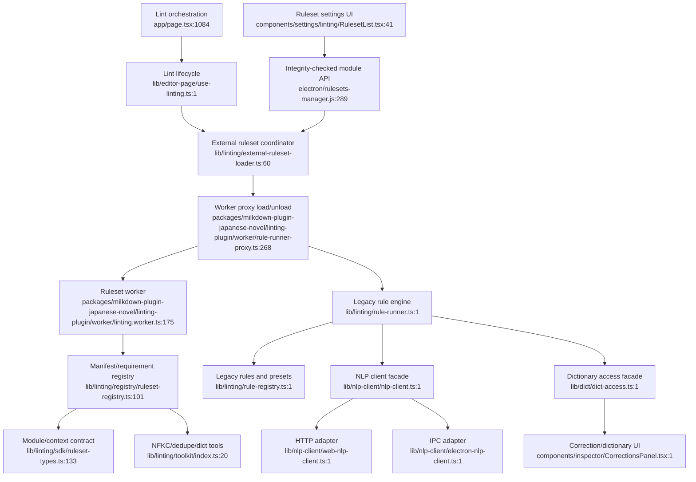

# Proofreading, dictionary, and NLP

External dependencies: project settings, ignored corrections, Electron IPC, Next API routes. This diagram reflects merged PR #1795 at `c183966`. Dictionary-backed rules must retain the documented not-ready fail-safe.
