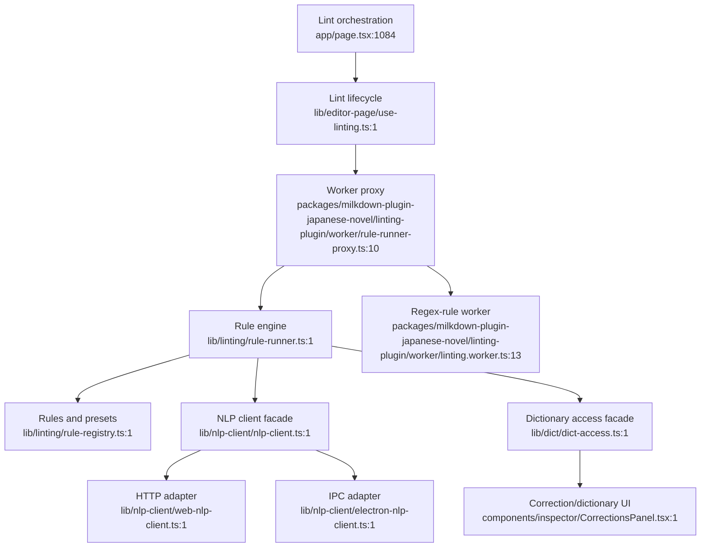

# Proofreading, dictionary, and NLP

External dependencies: project settings, ignored corrections, Electron IPC, Next API routes. Dictionary-backed rules must retain the documented not-ready fail-safe.
