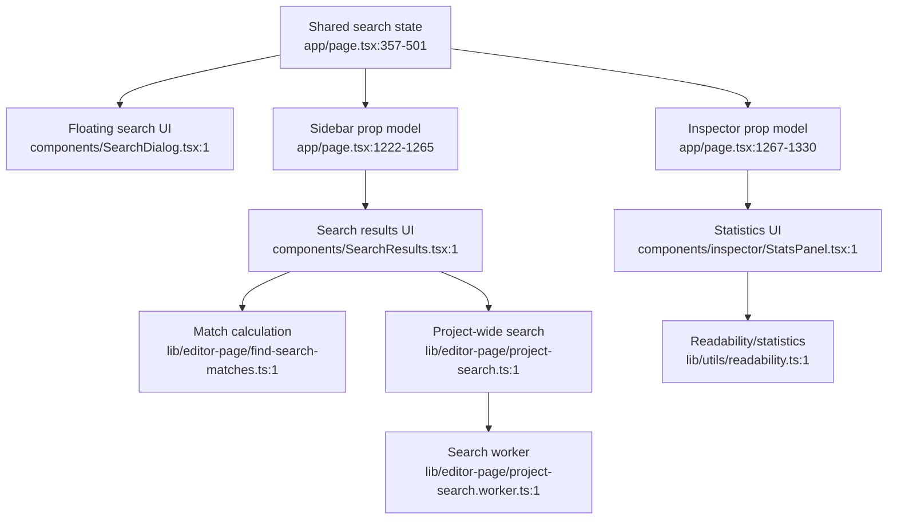

# Search and inspection

```mermaid
flowchart TD
  Page["Shared search state<br/>app/page.tsx:357-501"] --> Dialog["Floating search UI<br/>components/SearchDialog.tsx:1"]
  Page --> Sidebar["Sidebar prop model<br/>app/page.tsx:1222-1265"]
  Sidebar --> Results["Search results UI<br/>components/SearchResults.tsx:1"]
  Results --> Match["Match calculation<br/>lib/editor-page/find-search-matches.ts:1"]
  Results --> Project["Project-wide search<br/>lib/editor-page/project-search.ts:1"]
  Project --> Worker["Search worker<br/>lib/editor-page/project-search.worker.ts:1"]
  Page --> Inspector["Inspector prop model<br/>app/page.tsx:1267-1330"]
  Inspector --> Stats["Statistics UI<br/>components/inspector/StatsPanel.tsx:1"]
  Stats --> Analysis["Readability/statistics<br/>lib/utils/readability.ts:1"]
```

External dependencies: workspace buffers/VFS, editor selection, dictionary/NLP.
