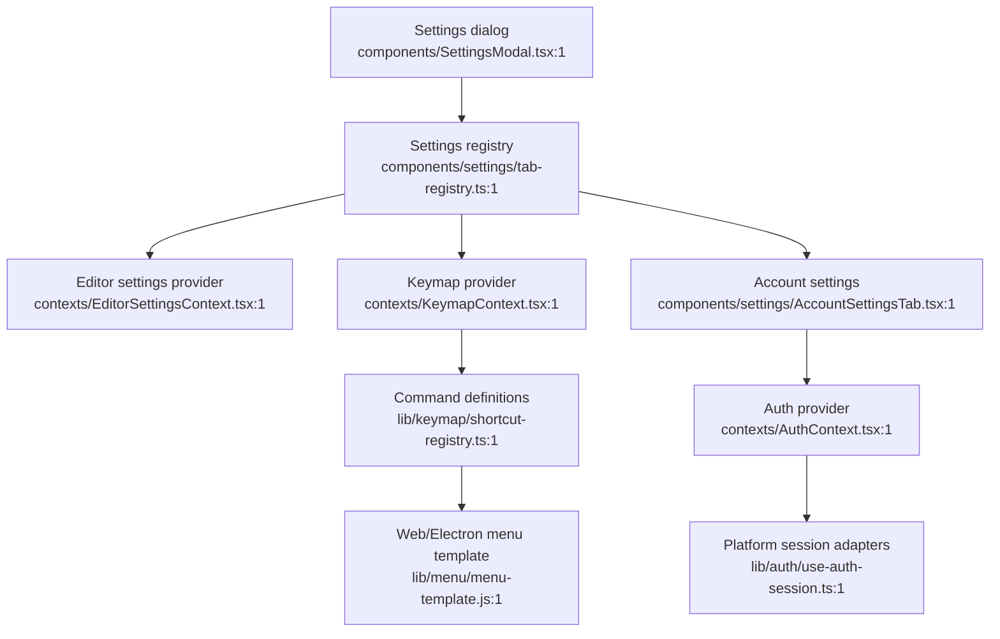

# Settings, authentication, and commands

```mermaid
flowchart TD
  Layout["Settings dialog<br/>components/SettingsModal.tsx:1"] --> Tabs["Settings registry<br/>components/settings/tab-registry.ts:1"]
  Tabs --> Settings["Editor settings provider<br/>contexts/EditorSettingsContext.tsx:1"]
  Tabs --> Keymap["Keymap provider<br/>contexts/KeymapContext.tsx:1"]
  Keymap --> Registry["Command definitions<br/>lib/keymap/shortcut-registry.ts:1"]
  Registry --> Menu["Web/Electron menu template<br/>lib/menu/menu-template.js:1"]
  Tabs --> Account["Account settings<br/>components/settings/AccountSettingsTab.tsx:1"]
  Account --> Auth["Auth provider<br/>contexts/AuthContext.tsx:1"]
  Auth --> Session["Platform session adapters<br/>lib/auth/use-auth-session.ts:1"]
```

External dependencies: app storage, Electron IPC, Next auth routes, editor feature settings.
