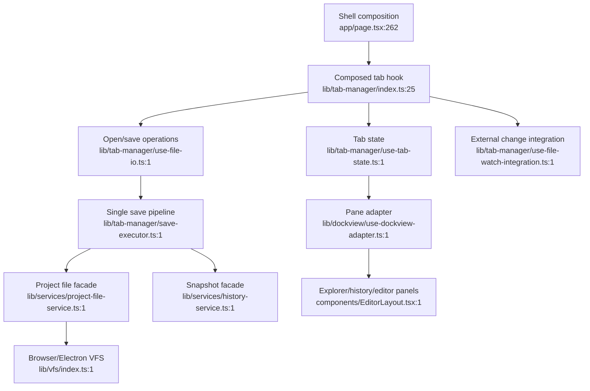

# Workspace and files

```mermaid
flowchart TD
  Page["Shell composition<br/>app/page.tsx:262"] --> Tabs["Composed tab hook<br/>lib/tab-manager/index.ts:25"]
  Tabs --> State["Tab state<br/>lib/tab-manager/use-tab-state.ts:1"]
  Tabs --> IO["Open/save operations<br/>lib/tab-manager/use-file-io.ts:1"]
  Tabs --> Watch["External change integration<br/>lib/tab-manager/use-file-watch-integration.ts:1"]
  IO --> Save["Single save pipeline<br/>lib/tab-manager/save-executor.ts:1"]
  Save --> Files["Project file facade<br/>lib/services/project-file-service.ts:1"]
  Save --> History["Snapshot facade<br/>lib/services/history-service.ts:1"]
  Files --> VFS["Browser/Electron VFS<br/>lib/vfs/index.ts:1"]
  State --> Dockview["Pane adapter<br/>lib/dockview/use-dockview-adapter.ts:1"]
  Dockview --> UI["Explorer/history/editor panels<br/>components/EditorLayout.tsx:1"]
```

External dependencies: storage, Electron renderer adapters, editor view, notifications.
