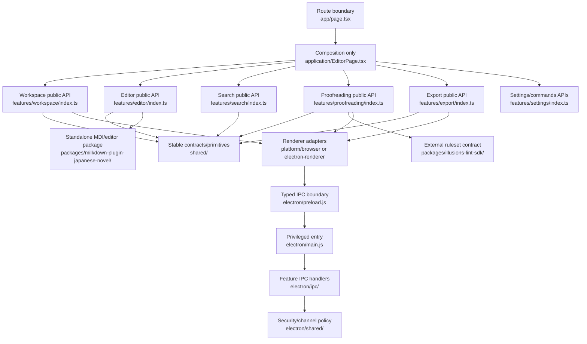

# Unified repository proposal

Date: 2026-06-19

## Decision

Organize by ownership, not by file type. Keep the root Next.js `app/` and the Electron entrypoints stable. Do **not** add a `src/` wrapper as a cosmetic mega-move: it would touch nearly every import without resolving the real ambiguity among `components/`, `contexts/`, `lib/editor-page/`, and `lib/services/`.

## Target tree

```text
app/                              # Next.js routes only
application/                      # renderer composition, providers, startup
  EditorPage.tsx
  providers/
  startup/
features/
  auth/{model,ui}/
  commands/{model,ui}/
  dictionary/{model,ui}/
  editor/{model,ui}/
  export/{model,ui,adapters}/
  proofreading/{model,ui,worker}/
  search/{model,ui,worker}/
  settings/{model,ui}/
  terminal/{model,ui}/
  workspace/{model,ui}/
platform/
  browser/                         # browser storage/VFS/auth/save adapters
  electron-renderer/               # typed window.electronAPI clients
shared/
  ui/                              # genuinely cross-feature primitives
  lib/                             # environment-neutral utilities only
  types/                           # cross-feature contracts only
electron/
  main.js                          # stable bundle entrypoint
  preload.js                       # stable security boundary
  ipc/
  services/{dictionary,rulesets,updates,windows}/
  shared/{ipc,security}/
packages/
  illusions-lint-sdk/               # stable external ruleset type/module contract
  milkdown-plugin-japanese-novel/  # standalone editor/MDI package; no @/ imports
assets/source/branding/            # editable design sources, never web-served
docs/
scripts/
store/
quicklook/
```

## Dependency rules

1. `app/` imports only `application/` and route-safe feature APIs.
2. `application/` composes features; it does not implement feature policy.
3. A feature may import `shared/`, `platform/` interfaces/adapters, and the public API of another feature. It must not reach into another feature's private folders.
4. `shared/` imports no feature, `application/`, or Electron main code.
5. `platform/browser/` and `platform/electron-renderer/` implement shared contracts and never import each other.
6. `electron/` is privileged Node code. Renderer modules may access it only through preload types and IPC.
7. The public ruleset module/context contract lives in a dedicated `packages/illusions-lint-sdk/`; registry, toolkit implementations, loader, worker, and UI remain owned by `features/proofreading/`.
8. `packages/milkdown-plugin-japanese-novel/` has no `@/` application imports and passes its own `tsconfig.json` independently.
9. Each feature exposes a small root `index.ts`; internal imports use relative paths. Avoid repository-wide barrels.

## Old-to-new ownership map

| Current location                                                                              | Target owner                                                                                                                                        |
| --------------------------------------------------------------------------------------------- | --------------------------------------------------------------------------------------------------------------------------------------------------- |
| `app/page.tsx`                                                                                | Thin route in `app/page.tsx`; composition in `application/EditorPage.tsx` and feature controllers.                                                  |
| `components/editor/*`, editor parts of root components                                        | `features/editor/ui/`                                                                                                                               |
| `lib/editor-page/*`                                                                           | Split among `features/editor/model`, `features/workspace/model`, `features/search/model`, `features/proofreading/model`, and `application/startup`. |
| `lib/tab-manager`, `lib/project`, workspace parts of `lib/services`, `lib/dockview`           | `features/workspace/`                                                                                                                               |
| `components/explorer`, `HistoryPanel*`, project wizard/permission UI                          | `features/workspace/ui/`                                                                                                                            |
| `lib/linting/sdk` public module/context types                                                 | `packages/illusions-lint-sdk/`; update the external template and `docs/ruleset/` in the same release.                                               |
| `lib/linting/{registry,toolkit}`, external loader, lint worker/plugin, ruleset/corrections UI | `features/proofreading/`; move the PR #1795 runtime chain atomically.                                                                               |
| `lib/dict`, user dictionary service, dictionary UI                                            | `features/dictionary/`                                                                                                                              |
| `lib/nlp-client`                                                                              | Interface in proofreading/shared contract; browser/Electron transports in `platform/`.                                                              |
| `lib/nlp-backend`                                                                             | Environment-neutral server/main backend under `features/proofreading/model/nlp-backend/` if it remains shared by both transports.                   |
| `lib/export`, export UI                                                                       | `features/export/`; platform-specific adapters remain explicit.                                                                                     |
| `components/settings`, EditorSettings context                                                 | `features/settings/`                                                                                                                                |
| `lib/keymap`, menu actions, Keymap context                                                    | `features/commands/`; platform menus are adapters.                                                                                                  |
| `lib/auth`, Auth context/account UI                                                           | `features/auth/`; route handlers remain in `app/api/auth`.                                                                                          |
| `lib/utils`                                                                                   | Domain utilities move to owners; only mutex/LRU/hash/text codec class utilities remain in `shared/lib`.                                             |
| `types/notification.ts`                                                                       | Notification owner under `application/` or `shared/notifications`; other types colocate with features.                                              |
| Electron top-level managers and `electron/lib`                                                | `electron/services/*` and `electron/shared/{ipc,security}` while keeping `main.js`/`preload.js` stable.                                             |

## Single entrypoints after reorganization

- Workspace: `features/workspace/index.ts`
- Editor: `features/editor/index.ts`
- Proofreading: `features/proofreading/index.ts`
- Dictionary: `features/dictionary/index.ts`
- Export: `features/export/index.ts`
- Settings: `features/settings/index.ts`
- Commands: `features/commands/index.ts`
- Auth: `features/auth/index.ts`
- Browser adapters: `platform/browser/index.ts`
- Electron renderer adapters: `platform/electron-renderer/index.ts`

These are public feature surfaces, not barrels that re-export every internal file.

## Proposed flow



## Explicitly rejected approaches

- No all-at-once `src/` migration.
- No compatibility aliases that preserve both old and new import paths indefinitely.
- No registry/factory layer merely to hide file moves.
- No behavior changes inside pure move PRs.
- No merging browser and Electron implementations across a security boundary.
- No keeping dead code behind flags “just in case”; Git history is the archive.
