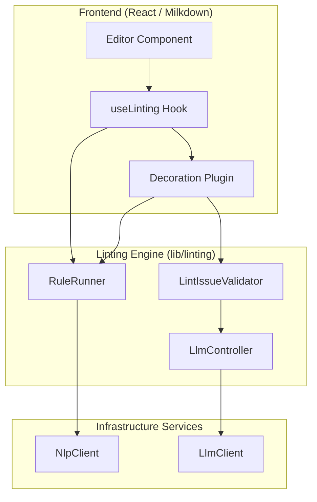
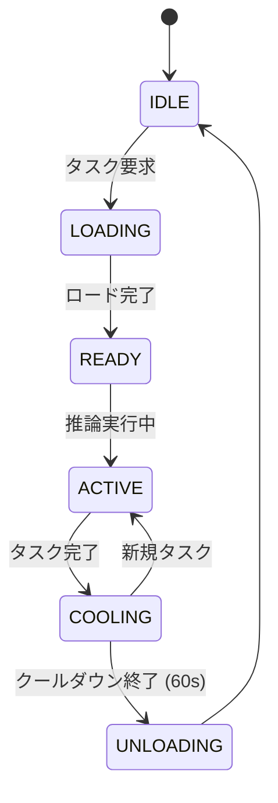

# 校正・AI校正システム 仕様書

本文書では、illusions における校正システムおよび AI を活用した校正エンジンの動作原理、アーキテクチャ、および設計詳細について記述します。

## 1. システム概要

本プロジェクトの校正システムは、執筆中のテキストに対してリアルタイムで品質チェックを行い、誤字脱字、表記揺れ、文法ミス、および文脈上の不自然さを検出します。システムは計算負荷と精度のバランスを取るため、3つのレイヤー（L1, L2, L3）で構成されています。

### 校正レベルの定義

| レベル | 名称 | 手法 | 対象 | 負荷 |
| :--- | :--- | :--- | :--- | :--- |
| **L1** | 基本校正 | 文字列一致、正規表現 | 誤字、記号の誤用、単純な重複 | 低 |
| **L2** | 形態素解析校正 | Sudachi/Kuromoji による形態素解析 | 品詞の誤用、助詞の連続、敬語の不整合 | 中 |
| **L3** | AI（LLM）校正 | 大規模言語モデル（LLM） | 文脈の矛盾、表現の改善提案、複雑な文法ミス | 高 |

---

## 2. アーキテクチャ

システムはエディタ（ProseMirror/Milkdown）のプラグインとして統合されており、バックエンド（Electron Main process または Next.js API）の解析サービスと連携します。

### 全体構造図



---

## 3. 動作原理

### 3.1. 校正の実行フロー

校正は、ユーザーの入力（タイピング）によるドキュメントの変更を検知してトリガーされます。

1.  **増分解析 (Incremental Linting)**: 変更があった段落のみを対象に L1/L2 ルールを実行します。
2.  **ドキュメント解析 (Document-level Linting)**: 表記揺れ（「私」と「わたし」の混在など）をチェックするため、ドキュメント全体を対象に定期的に実行されます。
3.  **L3 / AI検証**: L1/L2 で検出された問題のうち、誤判定の可能性が高いものを LLM で検証（Post-validation）し、確度の高いものだけを表示します。

### 3.2. AI校正 (L3) と検証 (Validator)

AI を活用した校正には2つのアプローチがあります。

#### A. AI による直接検出 (L3 Rules)
文脈に深く依存するルールです。段落または文を LLM に送信し、直接問題を抽出させます。
- **実装クラス**: `LlmLintRule` インターフェースを実装したルール。

#### B. AI による偽陽性フィルタリング (LintIssueValidator)
L1/L2 ルール（正規表現など）は、時に文脈を無視して誤検知（偽陽性）を発生させます。`LintIssueValidator` は、検出された問題を LLM に送り、「これは本当に間違いか？」を判定させます。
- **メリット**: 低負荷な正規表現で広く検出し、高精度な LLM で絞り込むことで、コストと精度の両立を図ります。

---

## 4. LLM ライフサイクル管理

LLM（特にローカル LLM）はメモリ消費が激しいため、`LlmController` によって厳格に管理されています。

### 状態遷移図



- **オートアンロード**: 推論タスクがなくなってから一定時間（デフォルト 60 秒）経過すると、自動的にモデルをメモリから解放し、システムリソース（VRAM/RAM）を節約します。
- **排他制御**: 複数のリクエストが同時に発生した場合、モデルの二重ロードを防ぐためにミューテックスによるシリアライズが行われます。

---

## 5. 形態素解析 (NLP) の連携

L2 ルールの実行には形態素解析が不可欠です。

- **処理の分離**: UI スレッドのブロッキングを防ぐため、形態素解析は常に非同期で行われ、結果は `NlpClient` を通じてバックエンドから取得します。
- **キャッシュ戦略**: 同一テキストの再解析を避けるため、フロントエンドとバックエンドの両方で LRU キャッシュ（MD5 ハッシュキー）を保持しています。

---

## 6. 主要な構成要素

### `RuleRunner` (lib/linting/rule-runner.ts)
- 全ての校正ルールの登録と実行を管理するオーケストレータ。
- ユーザー設定（Enabled/Disabled）やガイドラインに基づき、実行するルールをフィルタリングします。

### `LlmClient` (lib/llm-client/)
- 環境（Electron または Web）に応じた LLM 推論インターフェースを提供します。
- Electron では IPC 通信を通じてメインプロセスの LLM エンジンを呼び出します。

### `CorrectionConfig` (lib/linting/correction-config.ts)
- 執筆モード（小説、ビジネス、技術文書など）に応じたプリセット設定を管理します。

---

## 7. 拡張方法

新しい校正ルールを追加する場合は、`lib/linting/rules/` 内で以下のいずれかを継承します。

- **`AbstractLintRule`**: 基本的な L1 ルール。
- **`AbstractMorphologicalLintRule`**: トークンを利用する L2 ルール。
- **`AbstractDocumentLintRule`**: ドキュメント全体を俯瞰するルール。

AI を活用した新しい検証ロジックを追加する場合は、`prompts/lint-validation/` のプロンプトテンプレートを調整します。

---

## 8. ガイドライン（校正基準）に基づくルール管理

本システムでは、各校正ルールがどの公的基準やガイドライン（JIS、内閣告示、出版社基準など）に基づいているかを厳密に管理しています。

### 8.1. ガイドラインのメタデータ定義 (`guidelines.ts`)

すべての校正基準は `lib/linting/guidelines.ts` に定義されています。
- **ID**: 内部識別子（例: `jis-x-4051`, `koyo-bun-2022`, `okurigana-1973`）
- **名称**: 基準の正式名称
- **発行元**: 内閣告示、文化審議会、日本規格協会（JSA）などの機関名
- **ライセンス**: 公益性（Public）や著作権（Paid/CC）の区別

### 8.2. ルールとガイドラインの紐付け (`lint-presets.ts`)

個別のルールとガイドラインの対応関係は `lib/linting/lint-presets.ts` の `LINT_RULES_META` で静的に定義されています。

```typescript
{ 
  id: "punctuation-rules", 
  nameJa: "記号の作法", 
  guidelineId: "jis-x-4051" // JIS X 4051 に準拠
}
```

- **ユニバーサルルール**: `guidelineId` が未定義のルールは、特定の基準に依存しない一般的な誤字脱字チェックとして、すべてのモードで実行されます。

### 8.3. 校正モードによるフィルタリング (`correction-modes.ts`)

ユーザーが選択する「校正モード（小説、公用文、ブログ等）」に応じて、有効化されるガイドラインのセットが切り替わります。

- **公用文モード**: `koyo-bun-2022` (公用文作成の考え方) や `okurigana-1973` (送り仮名の付け方) を優先。
- **小説モード**: `novel-manuscript` (慣習的な原稿作法) や `jis-x-4051` (日本語組版) を優先。

### 8.4. 実行時のフィルタリングロジック (`rule-runner.ts`)

`RuleRunner` は実行時に以下のロジックでルールをフィルタリングします。

1. 現在のモードから「アクティブなガイドライン ID」のセットを取得します。
2. 各ルールに対し、以下のいずれかを満たす場合のみ実行を許可します。
   - ルールが `guidelineId` を持たない（ユニバーサルルール）。
   - ルールの `guidelineId` が、現在のアクティブなセットに含まれている。

### 8.5. 出典の明示 (Reference)

検出された各 `LintIssue` には、具体的な出典情報（規格名、セクション番号、参照 URL 等）を付与することができ、ユーザーが「なぜこれが間違いなのか」を公的基準に基づいて確認できるようになっています。
